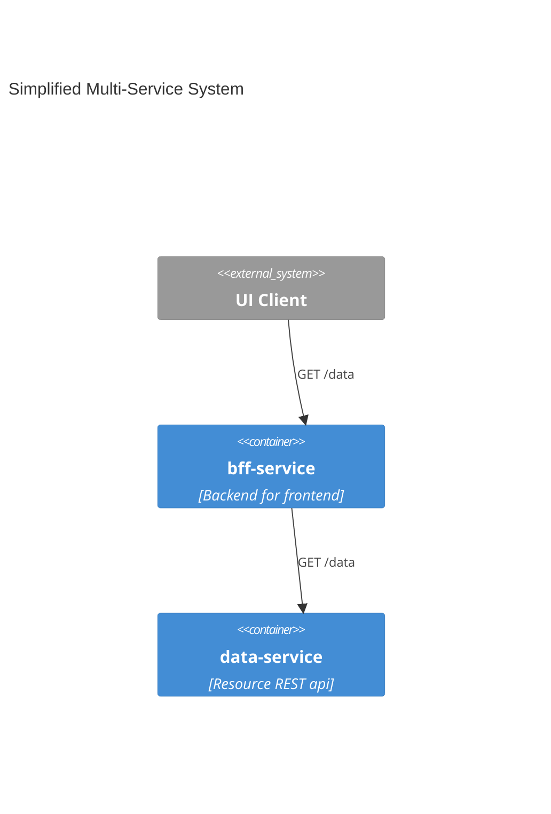

# Running Services Multiple Ways

This works through running the same basic system of a pseudo backend-for-front-end api serving up data from another service in 4 different ways:
* docker
* docker compose
* kubernetes
* kubernetes + ISTIO

Key features are:
* work through from what is possibly familar (docker) through to the new thing (istio)
* for each variation, do as little as possible with as little as possible in order to achieve the same result.


This works on a Mac. In particular, it means that the commands required to get access to the Kubernetes cluster running in minikube running in Docker on a Mac are included.

# The System



# Raw local

```
cd bff-service
pnpm install
node app.js
```

```
cd data-service
pnpm install
node app.js
```

```
curl localhost:3000
curl localhost:3000/data

curl localhost:4000
curl localhost:4000/data
```

# Prerequisites

* docker (tested with version 24.0.2)
* docker compose (usually going to come with docker) (tested with version 2.18.1)
* [minikube](https://minikube.sigs.k8s.io/docs/start/) (tested with minikube version: v1.30.1)

# Docker edition:

```

cd bff-service
docker build -t bff-service:1 .

cd ../data-service
docker build -t data-service:1 .

docker network create tut
docker run --rm -it --network tut --name data-service -d data-service:1
docker run --rm -it --network tut -e DATA_SOURCE_HOST='data-service' -e DATA_SOURCE_PORT='4000' -e DATA_SOURCE_PROTOCOL='http' -p 3000:3000 --name bff-service -d bff-service:1

curl localhost:3000/data
```

docker ps should look something like:
f4f0cdc0809e   bff-service   "docker-entrypoint.s…"   5 min...         0.0.0.0:3000->3000/tcp          bff-service
df9330651693   data-service  "docker-entrypoint.s…"   7 min...         4000/tcp                        data-service

A key thing to note here is that port 3000 is accessible locally, but not 4000.
However, the bff-service can talk to the data-service because they are both on the 'tut' network.

```
docker stop bff-service data-service
```

# Docker Compose Edition

```
cd k8-istio-intro
docker compose up -d
docker network ls
docker ps
curl localhost:3000/data
docker compose down
```

One thing to note here is that the name of the DATA_SOURCE_HOST is now 'data', because that is the name of the data service in the docker-compose.yml file. What is holding everything together now is the identification of things within the docker-compose file. It isn't a service discovery service, but the docker-compose.yml file is serving the role of specifying how to discover the services on the network.

# Kubernetes edition

## Prerequisites

* kubectl on the path
    * try `brew install kubectl`

```
minikube start 

# Copy the docker images from your machine into the minikube instance.
minikube image load bff-service:1
minikube image load data-service:1
minikube image ls

cd basic-k8-istio-tutorial

kubectl apply -f data-service-config.yaml
kubectl apply -f data-service.yaml
kubectl apply -f bff-service-nodeport.yaml
minikube service bff-service --url
# then, using the host:port provided...

curl 127.0.0.1:57485
curl 127.0.0.1:57485/data

minikube stop
minikube delete
```

# ISTIO Edition

## Prerequisites

* istioctl on the path.
    * try downloading as per [ISTIO getting started](https://istio.io/latest/docs/setup/getting-started/), but only go as far as getting `istioctl` on the path.


```
minikube start --memory=16384 --cpus=4 --kubernetes-version=v1.26.1
istio install
kubectl label namespace default istio-injection=enabled

# since we completely destroyed minikube, once more...
minikube image load bff-service:1
minikube image load data-service:1
minikube image ls


# in another terminal, and get ready to provide your password...
minikube tunnel


kubectl apply -f istio-ingress-gateway.yaml
kubectl apply -f data-service-config.yaml
kubectl apply -f data-service.yaml
kubectl apply -f data-service-new.yaml
kubectl apply -f data-service-virtual.yaml
kubectl apply -f bff-service.yaml

curl http://127.0.01:80/data
curl http://127.0.01:80/data -H "bff-version: new"
```

# Resources
[Kubernetes crash course](https://www.youtube.com/watch?v=s_o8dwzRlu4)
    * In just over 1 hour, this course covers the key concepts required to understand most of what is covered here.
[Extended Kubernetes not-so-crash course](https://www.youtube.com/watch?v=X48VuDVv0do)
    * In just over 4 hours, this course fills in quite a bit more detail beyond the 1 hour course.
[ISTO Documentation](https://istio.io/latest/)
    * Having given up in frustration at finding a very basic ISTIO intro tutorial that was for the current version and actually worked, I found the ISTIO documentation the best place to start.
[k9s](https://k9scli.io/)
    * Purely optional, but I found k9s helpful in poking around what was going on in the kubernetes cluster. It's closely aligned to the kubectl cli, but I'd suggest not relying on it too much, be familiar with the kubectl cli.

